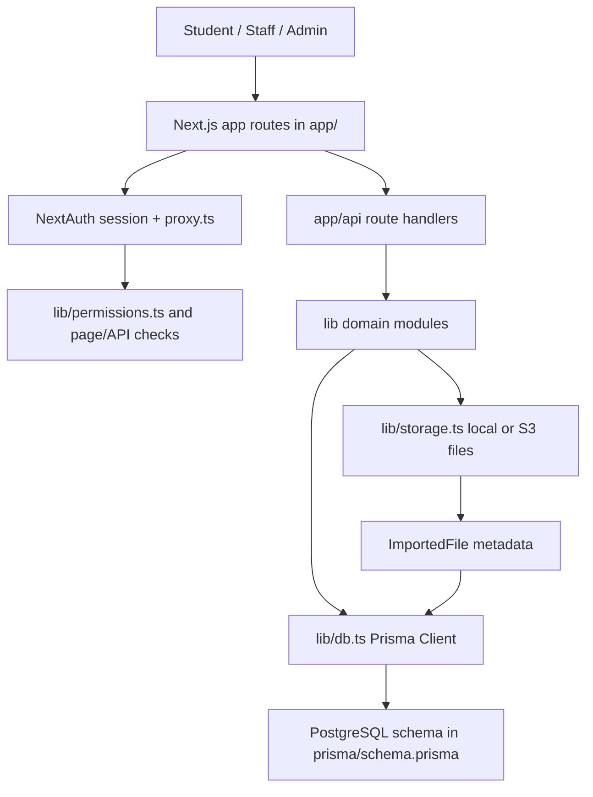

## For future Claude

This note describes the [[dbsmo]] system architecture and data flow, source-verified on 2026-06-26. It focuses on how Next.js routes, auth, Prisma, grading, imports, storage, analytics, classes, and FTW features fit together.

## Architectural Shape

[[dbsmo]] is a monolithic Next.js App Router application: UI routes, server components, client components, and API route handlers all live under `app/`, while reusable domain logic lives under `lib/` (sources: `app/`, `app/api/`, `lib/`, `package.json`). The database boundary is centralized through `lib/db.ts`, which constructs a Prisma Client using `@prisma/adapter-pg` and requires `DATABASE_URL`.

The main architectural layers are:

- Presentation: route pages and UI components under `app/`, with shared visual state mostly in CSS and client component local state (sources: `app/layout.tsx`, `app/globals.css`, `app/site-sidebar.tsx`, `app/problem-sets/[slug]/answer-grid.tsx`).
- Route handlers: API endpoints under `app/api/` validate requests, load sessions, enforce permissions, call `lib/` functions, and persist with Prisma (sources: `app/api/submit/route.ts`, `app/api/admin/sets/[id]/route.ts`, `app/api/admin/import/commit/route.ts`, `app/api/ftw/rooms/[code]/submit/route.ts`).
- Domain modules: grading, imports, storage, visibility, permissions, classes, analytics, FTW, and exports under `lib/` (sources: `lib/grading.ts`, `lib/import/json-import.ts`, `lib/storage.ts`, `lib/visibility.ts`, `lib/permissions.ts`, `lib/classes.ts`, `lib/analytics.ts`, `lib/ftw-room-server.ts`).
- Persistence: Prisma models in `prisma/schema.prisma` with PostgreSQL backing; binary files are stored outside the database and referenced by `ImportedFile` metadata.

## Module Flow

## Auth and Authorization

Authentication is configured in `lib/auth.ts`. Google OAuth is enabled only when `GOOGLE_CLIENT_ID` and `GOOGLE_CLIENT_SECRET` are set; a credentials "Developer Bypass" provider exists outside production unless `AUTH_DEV_BYPASS=false` (source: `lib/auth.ts`). Sessions use JWT strategy, but the session callback reloads current role/group from Prisma so role changes are reflected without trusting stale token state (source: `lib/auth.ts`).

Route-level middleware in `proxy.ts` requires a token for `/admin`, `/dashboard`, and `/problem-sets`, and redirects non-admin users away from `/admin` to `/dashboard?notice=admin-required` (source: `proxy.ts`). This is only the first gate: admin pages and APIs also check role permissions via `lib/permissions.ts` and `hasPermission(...)` (sources: `lib/permissions.ts`, `app/api/admin/sets/[id]/route.ts`, `app/api/admin/export-jobs/route.ts`, `app/api/admin/classes/[id]/route.ts`).

Important nuance: `proxy.ts` treats `/admin` as admin-only by raw role, but `lib/permissions.ts` defines non-admin staff roles (`TEACHER`, `CONTENT_EDITOR`, `ANALYST`) that can have `admin:view` or other admin permissions. This is a potential mismatch; see [[Risks and Pitfalls]] (sources: `proxy.ts`, `lib/permissions.ts`).

## Problem Set Flow

Problem set browsing starts at `app/problem-sets/page.tsx`, which loads all sets, filters visibility for non-admin users through `isVisibleToStudent(...)`, computes attempts, bookmarks, assignments, recommendations, weak-topic metrics, media filters, status filters, category filters, and pagination (sources: `app/problem-sets/page.tsx`, `lib/visibility.ts`, `lib/problem-tags.ts`, `lib/problem-set-order.ts`).

Problem detail is handled by `app/problem-sets/[slug]/page.tsx`. It loads the set, problems, files, assets, creator, bookmarks, and previous attempts; non-admin users only see visible sets. The page chooses inline statement rendering when every problem has statement text, otherwise it falls back to PDF/file presentation (source: `app/problem-sets/[slug]/page.tsx`).

The answer grid is client-side and posts to `/api/submit`. It autosaves draft answers to `localStorage`, stores "review later" state in `localStorage`, supports feedback report submission, clears autosave after successful submission, and blocks answer entry/submission controls when a perfect attempt locks the set while keeping problem statements visible (source: `app/problem-sets/[slug]/answer-grid.tsx`).

Submission is persisted in `app/api/submit/route.ts`: it checks session, validates JSON with Zod, loads the `ProblemSet`, checks visibility, prevents new attempts after a perfect attempt, grades each problem through `gradeAnswer(...)`, creates an `Attempt`, creates `Response` records, and returns score/results (sources: `app/api/submit/route.ts`, `lib/grading.ts`, `prisma/schema.prisma`).

## Writeup Flow

Problem-set writeups are a separate readable/community surface at `/problem-sets/[slug]/writeups`, linked from the set header next to bookmarks. The server page requires auth, verifies set visibility for students, loads writeups with authors/images/votes, and sorts by newest or top score (source: `app/problem-sets/[slug]/writeups/page.tsx`). The sidebar `/writeups` directory lists latest/top writeups across visible sets and supports problem-set-focused search (source: `app/writeups/page.tsx`).

The client feed posts multipart form data to `POST /api/problem-sets/[id]/writeups`, supports LaTeX/HTML bodies and up to four images, renders bodies through `LatexStatement`, sends vote mutations to `POST /api/writeups/[id]/vote`, and shows a confirm-delete control for author/admin deletion through `DELETE /api/writeups/[id]` (sources: `app/problem-sets/[slug]/writeups/writeups-client.tsx`, `app/api/problem-sets/[id]/writeups/route.ts`, `app/api/writeups/[id]/vote/route.ts`, `app/api/writeups/[id]/route.ts`).

Writeup images reuse the existing storage/file-serving boundary: `lib/writeup-images.ts` validates and stores image bytes, `WriteupImage` ties the resulting `ImportedFile` to the writeup, and `app/api/files/[id]/route.ts` grants access if the related problem set is visible or the requester is admin (sources: `lib/writeup-images.ts`, `prisma/schema.prisma`, `app/api/files/[id]/route.ts`).

## Grading Flow

`lib/grading.ts` is the deterministic grading engine. It normalizes answers by answer type and supports exact, integer, decimal, fraction, set, multiple, and expression answers (source: `lib/grading.ts`). It is used by normal submissions, practice submissions, admin regrade, FTW solo, and FTW room submissions (source: CodeGraph callers for `gradeAnswer`, plus `app/api/submit/route.ts`, `app/api/practice/submit/route.ts`, `app/api/admin/sets/[id]/regrade/route.ts`, `app/api/ftw/matches/[id]/submit/route.ts`, `app/api/ftw/rooms/[code]/submit/route.ts`).

## Import and Authoring Flow

Manual/admin authoring uses `lib/problem-set-authoring.ts` for slug validation, uploaded PDF payload schema, create/patch schemas, problem normalization, answer-key splitting, and duplicate problem-number checks (source: `lib/problem-set-authoring.ts`). The admin edit route updates problem set metadata and replaces/updates/deletes child problems inside a Prisma transaction (source: `app/api/admin/sets/[id]/route.ts`).

JSON import uses `lib/import/json-import.ts`: it validates a problem set JSON payload, supports import dry-run, import commit, and import-to-editor draft, normalizes statement format and answer types, validates assets, persists problem sets/problems, and can replace an existing set while preserving its ID/order path where applicable (source: `lib/import/json-import.ts`).

ZIP import uses `lib/import/zip-dry-run.ts` and `lib/import/zip-import.ts`: it checks ZIP signature and size, blocks unsafe paths, requires `manifest.yml`/`manifest.yaml`, parses `answers.csv`, validates referenced files, validates duplicate/problem-number sequencing, builds a preview, then persists files and set records (sources: `lib/import/zip-dry-run.ts`, `lib/import/zip-import.ts`, `lib/import/zip-path.ts`, `lib/import/manifest-schema.ts`, `lib/import/answer-schema.ts`).

## Storage Flow

Binary files are represented in Prisma by `ImportedFile` and stored under storage keys. `lib/storage.ts` supports local filesystem storage by default and an S3-compatible request-signing path when `STORAGE_DRIVER=s3` (source: `lib/storage.ts`). Uploaded PDFs are validated as base64 `data:application/pdf` URLs with a 25 MB limit and saved through `storeUploadedPdf(...)` (source: `lib/uploaded-pdf.ts`).

File downloads are served by `app/api/files/[id]/route.ts`, which checks the requested `ImportedFile`, finds related problem sets/assets, allows admins or users who can see at least one related set, reads bytes via `readFileBuffer(...)`, and returns security headers including `nosniff` and a restrictive CSP sandbox (source: `app/api/files/[id]/route.ts`).

## Classes and Assignment Flow

Classes and assignments are persisted by `Class`, `ClassMember`, and `Assignment` models (source: `prisma/schema.prisma`). Admin class detail APIs call `loadAuthorizedClass(...)` to require `admin:users`, restrict non-admin teachers to their own class, and compute assignment completion from attempts after assignment creation using `buildCompletionMap(...)` (sources: `app/api/admin/classes/[id]/route.ts`, `lib/classes.ts`).

The student dashboard includes `AssignmentsWidget`, which fetches `/api/assignments/mine`, sorts incomplete items before complete items and nearer due dates first, then shows up to five assigned problem sets (source: `app/dashboard/assignments-widget.tsx`).

## Analytics, Audit, Export

Analytics helpers in `lib/analytics.ts` compute topic accuracy, score buckets, question stats, CSV escaping, and best-average score (source: `lib/analytics.ts`). Admin analytics pages and charts render filtered attempts/completions/averages with UI filters and an SVG trend chart (sources: `app/admin/analytics/page.tsx`, `app/admin/analytics/filters.tsx`, `app/admin/analytics/trend-chart.tsx`).

Audit logs are stored in `AuditLog` and written through `recordAuditLog(...)` for meaningful admin actions such as set updates/deletes and export jobs (sources: `prisma/schema.prisma`, `lib/audit.ts`, `app/api/admin/sets/[id]/route.ts`, `app/api/admin/export-jobs/route.ts`).

Export jobs are synchronous API work persisted as `ExportJob` records. `app/api/admin/export-jobs/route.ts` validates `ExportJobType`, creates a `RUNNING` job, builds CSV or backup JSON through `lib/admin-exports.ts`, stores content in `payload`, and marks the job completed/failed (sources: `app/api/admin/export-jobs/route.ts`, `lib/admin-exports.ts`).

## FTW and Playground Flow

FTW solo mode creates `FtwMatch` and `FtwAnswer` records and scores answers by correctness plus elapsed time (sources: `lib/ftw.ts`, `app/api/ftw/matches/route.ts`, `app/api/ftw/matches/[id]/problem/route.ts`, `app/api/ftw/matches/[id]/submit/route.ts`, `prisma/schema.prisma`).

FTW rooms use `FtwRoom`, `FtwRoomPlayer`, `FtwRoomProblem`, and `FtwRoomAnswer`. Room host transfer/close behavior is pure logic in `lib/ftw-room-host.ts`; room progression and due-time advancement are in `lib/ftw-room-server.ts`; client polling/interaction lives in `app/ftw/room/[code]/room-client.tsx` (sources: `lib/ftw-room.ts`, `lib/ftw-room-host.ts`, `lib/ftw-room-server.ts`, `app/ftw/room/[code]/room-client.tsx`).

Playground boss battles are a separate client/game surface driven by static boss definitions in `lib/playground/bosses.ts` and a localStorage trophy key in `app/playground/[slug]/battle.tsx`; it is not backed by Prisma in the inspected paths (sources: `lib/playground/bosses.ts`, `app/playground/[slug]/battle.tsx`).

## Key Design Decisions Inferred From Source

- The app favors route-handler/domain-module locality over a separate service layer; API handlers often combine auth, validation, transactions, and response shaping (confidence: high; sources: `app/api/*/route.ts`, `lib/*`).
- `prisma db push` is the documented deployment path, not migrations, even though migration files exist in `prisma/migrations/` (confidence: high; sources: `SETUP.md`, `prisma/migrations/`).
- File bytes are intentionally outside the database, while DB rows retain storage keys, metadata, and relations to problem sets/assets (confidence: high; sources: `lib/storage.ts`, `prisma/schema.prisma`, `app/api/files/[id]/route.ts`).
- Practice mode uses one durable solve record per user/problem and only counts correct answers (confidence: high; sources: `PracticeSolve` in `prisma/schema.prisma`, `app/api/practice/submit/route.ts`).
